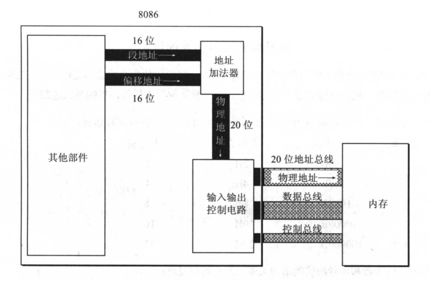
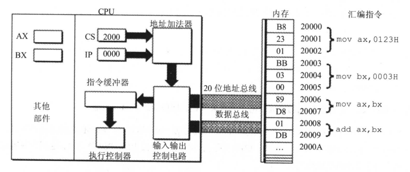

### 第二章 寄存器（CPU工作原理）

内部总线实现CPU内部各个器件之间的联系，外部总线实现CPU和主板上其它器件的联系。在CPU中：运算器进行信息处理、寄存器进行信息存储、控制器控制各种器件进行工作、内部总线连接各种器件，在它们之间进行数据传输。

汇编程序员通过改变各种寄存器中的内容来实现对CPU的控制。

8086CPU有14个寄存器，分别是：AX、BX、CX、DX、SI、DI、SP、BP、IP、CS、SS、DS、ES、PSW。

#### 2.1 通用寄存器

8086CPU的所有寄存器都是16位的，可以存放2个字节。AX、BX、CX、DX四个寄存器通常用来存放一般性数据，被称为通用寄存器。为了兼容上一代8位寄存器的CPU，8086CPU的AX、BX、CX、DX都可分为两个独立使用的8位寄存器来用：

* AX可分为AH和AL
* BX可分为BH和BL
* CX可分为CH和CL
* DX可分为DH和DL

以AX为例，8086CPU的16位寄存器逻辑结构如下：

```
|—————————————————————————————————AX——————————————————————————————————|
| 15 | 14 | 13 | 12 | 11 | 10 | 9 | 8 | 7 | 6 | 5 | 4 | 3 | 2 | 1 | 0 |
|____|____|____|____|____|____|___|___|___|___|___|___|___|___|___|___|
|———————————————AH————————————————————|—————————————AL————————————————|
| 7  | 6  | 5  | 4  | 3  |  2 | 1 | 0 | 7 | 6 | 5 | 4 | 3 | 2 | 1 | 0 |
|____|____|____|____|____|____|___|___|___|___|___|___|___|___|___|___|

```

#### 2.2 字在存储器中的存储

出于兼容性的考虑，8086CPU可以一次性处理两种尺寸的数据：

* 字节：记为byte，一个字节由8个bit组成，可以存放在8位寄存器中
* 字：记为word，一个字由两个字节组成，这两个字节分别被称为这个字的高位字节和低位字节

#### 2.3 几条汇编指令

汇编指令举例：

|汇编指令   |控制CPU完成的操作     |用高级语言的语法描述|
|:---------|:-------------------------------|:-------|
|mov ax, 18|将18送入寄存器AX                 |AX=18   |
|mov ah, 78|将78送入寄存器AH                 |AH=18   |
|add ax,  8|将寄存器AX中的数值加上8           |AX=AX+8 |
|mov ax, bx|将寄存器BX中的数据送入寄存器AX    |AX=BX   |
|add ax, bx|将AX和BX中的数值相加，结果存在AX中|AX=AX+BX|
|||

在进行数据传送或运算时，要注意指令的两个操作对象的位数应当是一致的。

#### 2.4 物理地址

CPU访问内存单元时，要给出内存单元的地址。所有构成内存单元的存储空间是一个一维的线性空间，每个内存单元在这个空间中都有唯一的地址，这个地址为物理地址。

#### 2.5 16位结构的CPU

16位结构描述了CPU下面的几个结构特性：

* 运算器一次最多可以处理16位数据
* 寄存器最大位宽为16位
* 寄存器和运算器之间的通路为16位

也就是说：8086内部一次性处理、传输、暂存的数据最大长度为16位。

#### 2.6 8086CPU给出物理地址的方法

8086CPU有20位地址总线，可以传送20位地址，具有1MB的寻址能力。8086CPU为16位结构，一次性处理、存储、暂存的地址为16位。

8086CPU采用两个16位地址合成的方法来形成一个20位的物理地址，相关部件逻辑结构如图：
<div align=center>

</div>

当8086CPU要读写内存时：

* CPU中的相关部件提供两个16位的地址，一个称为段地址，另一个被称为偏移地址
* 段地址和偏移地址通过内部总线送入一个称为地址加法器的部件
* 地址加法器通过内部总线将20位物理地址送入输入输出控制电路
* 输入输出控制电路将20位物理地址送入地址总线
* 20位物理地址被地址总线传送到存储器

地址加法器采用**物理地址=段地址x16+偏移地址**的方法用段地址和偏移地址合成物理地址

#### 2.7 “段地址x16+偏移地址=物理地址”的本质含义

“段地址x16+偏移地址=物理地址”的本质含义是：CPU在访问内存时，用一个基础地质（段地址x16）和一个相对于基础地质的偏移地址相加，给出内存单元的物理地址。更一般的说，8086CPU的这种寻址功能是“基础地址+偏移地址=物理地址”寻址模式的一种具体实现方案。

#### 2.8 段的概念

内存并没有分段，段的划分来自于CPU，由于8086CPU采用“基地址（段地址x16）+偏移地址=物理地址”的方式给出内存单元的物理地址，使得我们可以用分段的方式来管理内存。所以，在编程时可以根据需要，将若干地址连续的内存单元看作一个段，用段地址x16定位段的起始地址（基地址），用偏移地址定位段中的内存单元。需要注意两点：段地址x16必然是16的倍数，所以一个段的起始地址也一定是16的倍数；偏移地址为16位，16位地址的寻址能力为64KB，所以一个段的长度最大是64KB。

#### 2.9 段寄存器

8086CPU有4个段寄存器：CS、DS、SS、ES。当8086CPU要访问内存时由这4个段寄存器提供内存单元的段地址。

#### 2.10 CS和IP

CS和IP是8086CPU中最关键的寄存器，它们指示了CPU当前要读取指令的地址。CS为代码段寄存器，IP为指令寄存器。

8086CPU中，任意时刻，CPU将CS：IP指向的内容当作指令执行

<div align=center>

</div>

8086CPU的工作过程简要描述如下：

* 从CS：IP指向的内存单元读取指令，读取的指令进入指令缓冲器
* IP=IP+读取指令的长度，从而指向下一条指令
* 执行指令，转到步骤1，重复这个过程

在8086CPU加电启动或复位后（即CPU刚开始工作时）CS和IP被设置为CS=FFFFH，IP=0000H，即8086CPU刚启动时，CPU从内存FFFF0H单元中读取指令执行，FFFF0H单元中的指令是8086CPU开机执行的第一条指令。

在任何时候，CPU将CS、IP中的内容当作指令的段地址和偏移地址，用它们合成物理地址，到内存中读取指令、执行。

#### 2.11 修改CS、IP的指令

8086CPU大部分寄存器的值，都可以用mov指令来改变，mov指令被称为传送指令。但是，mov指令不能用于设置CS、IP的值，因为8086CPU没有提供这样的功能。

若想同时修改CS、IP的内容，可用指令“jmp 段地址：偏移地址”完成，例如：

```
jmp 2AE3:3 #执行后：CS=2AE3H，IP=0003H，CPU将从2AE33H处读取指令
jmp 2:0B16 #执行后：CS=0003H，IP=0B16H，CPU将从00B46H处读取指令
```

jmp 段地址：偏移地址 指令的功能为：用指令中给出的段地址修改CS，偏移地址修改IP

若想仅修改IP的内容，可用指令 “jmp 某一合法寄存器”完成，如：

```
jmp ax, 指令执行前：ax=1000H，CS=2000H，IP=0003H
        指令执行后：ax=1000H，CS=2000H，IP=1000H
jmp bx，指令执行前：bx=0B16H，CS=2000H，IP=0003H
        指令执行后：ax=0B16H，CS=2000H，IP=0B16H
```

指令“jmp 某一合法寄存器”的功能为：用寄存器中的值修改IP。jmp ax，在含以上类似于mov IP, ax这样的指令

#### 2.12 代码段

将一段内存当作代码段，仅仅是我们在编程时的一种安排，CPU并不会由于这种安排，就自动地将我们定义的代码段中的指令当作指令来执行。CPU只认被CS：IP执行的内存单元中的内容为指令。

要让CPU执行我们放在代码段中的指令，必须要将CS：IP指向所定义的代码段中的第一条指令的首地址。

#### 小结

* 段地址在8086CPU的段寄存器中存放。当8086CPU要访问内存时，由段寄存器提供内存单元的段地址。8086CPU有4个段寄存器，其中CS用来存放指令的段地址
* CPU存放指令的段地址，IP存放指令的偏移地址。8086机中，任意时刻，CPU将CS：IP指向的内容当作指令执行
* 8086CPU的工作过程
    * 从CS：IP指向的内存单元读取指令，读取的指令进入指令缓冲器；
    * IP指向下一条指令；
    * 执行指令。（转到步骤（1），重复这个过程）
* 8086CPU提供转移指令修改CS、IP的内容