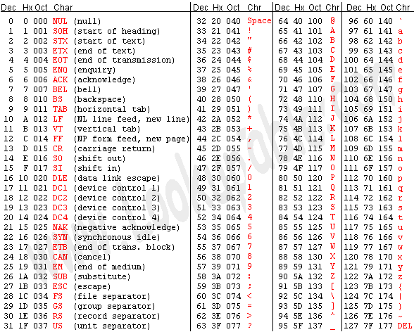

### 第七章 更灵活的定位内存地址的方法

#### and和or指令

and指令：逻辑与指令，按位进行与运算；or指令：逻辑或指令，按位进行或运算

#### 关于ASCII码



#### 以字符形式给出的数据

汇编中用'……'的方式指明数据是以字符的形式给出的，编译器将它们转化为相对应的ASCII码。

```
assume ds:data
data segment
    db 'unix'
    db 'fork'
data ends

code segment
start:  mov al, 'a'
        mov bl, 'b'
        mov ax, 4c00H
        int 21H
code ends
end start
```

上面源代码中：`db 'unix'`相当于`db 75H, 6EH, 49H, 58H`，`mov al, 'a'`相当于`mov al, 64H`

#### 大小写转化的问题

```
assume cs:code, ds:data
data segment
    db 'BaSic'
    db 'iNfOrMaTiOn'
data ends

code segment
start:  mov ax, data
        mov ds, ax
        mov bx, 0
        mov cx, 5

s0:     mov al, [bx]
        and al, 11011111B
        mov [bx], al
        inc bx
        loop s0

        mov bx, 5
        mov cx, 11

s1      mov al, [bx]
        or al, 00100000B
        mov [bx], al
        inc bx
        loop s1

        mov ax, 4c00H
        int 21H

code ends
end start
```

#### [bx+idata]

[bx+idata]表示一个内存单元，它的偏移地址为`(bx)+idata`(bx中的数值加上idata)

例如：`mov ax, [bx+100]`表示偏移地址为`bx`中的数值加上200，段地址在ds中，数学化的描述为：`(ax)=((ds)*16+(bx)+200)`，该指令也可以写成如下格式

```
mov ax, [200+bx]
mov ax, 100[bx]
mov ax, [bx].200
```

#### 用[bx+idata]的方式进行数组的处理

```
assume cs:code, ds:data
data segment
    db 'BaSiC'
    db 'MinIX'
data ends

code segment
start:
    mov ax, data
    mov ds, ax
    
    mov bx, 0
    mov cx, 5

s:
    mov al, [bx]
    and al, 11011111B
    mov [bx], al
    mov al, [bx+5]
    or al, 00100000B
    mov [bx+5], al
    inc bx
    loop s

    mov ax, 4c00h
    int 21h

code ends
end start
```

#### SI和DI

SI和DI是8086CPU中和bx功能相近的寄存器，SI和DI不能够分成两个8位寄存器来使用。

#### [bx+si]和[bx+di]

前面用`[bx(si/di)]`和`[bx(si/di)+idata]`的方式来指明一个内存单元，而`[bx+si]`和`[bx+di]`的方式更加灵活

`[bx+si]`表示一个内存单元，它的偏移地址为`(bx)+(si)`，即`bx`中的数值加上`si`上的数值。

`mov ax, [bx+si]`的含义为：将一个内存单元的内容送入ax，这个内存单元的长度为2字节，存放一个字，偏移地址为bx中的数值加上si中的数值，段地址在ds中；数学描述为：`(ax)=((ds)*16+(bx)+(si))`；该指令也可以写成以下格式：

```
mov ax, [bx][si]
```

#### [bx+si+idata]和[bx+di+idata]

`[bx+si+idata]`和`[bx+di+idata]`的含义类似，都表示一个内存单元，它的偏移地址为`(bx)+(si)+idata`（即bx中的数值加上si中的数值再加上idata）

`mov ax, [bx+si+idata]`的含义为：将一个内存单元的内容送入ax，这个内存单元的长度为2字节，存放一个字，偏移地址为bx中的数值加上si中的数值再加上idata，段地址在ds中；数学描述为：`(ax)=((ds)*16+(bx)+(si)+idata)`；该指令也可以写成以下格式：

```
mov ax, [bx+200+si]
mov ax, [200+bx+si]
mov ax, 200[bx][si]
mov ax, [bx].200[si]
mov ax, [bx][si].200
```

#### 不同寻址方式的灵活应用

对比几种定位内存地址的方式（可称为寻址方式），有以下几种形式：

* `[idata]`用一个常量来表示地址，可用于直接定位一个内存单元
* `[bx]`用一个变量来标识内存地址，可用于间接定位一个内存单元
* `[bx+idata]`用一个变量和常量表示地址，可在一个起始地址的基础上用变量间接定位一个内存单元
* `[bx+si]`用两个变量表示地址
* `[bx+si+idata]`用两个变量和一个常量表示地址

**问题7.6-7.8**


